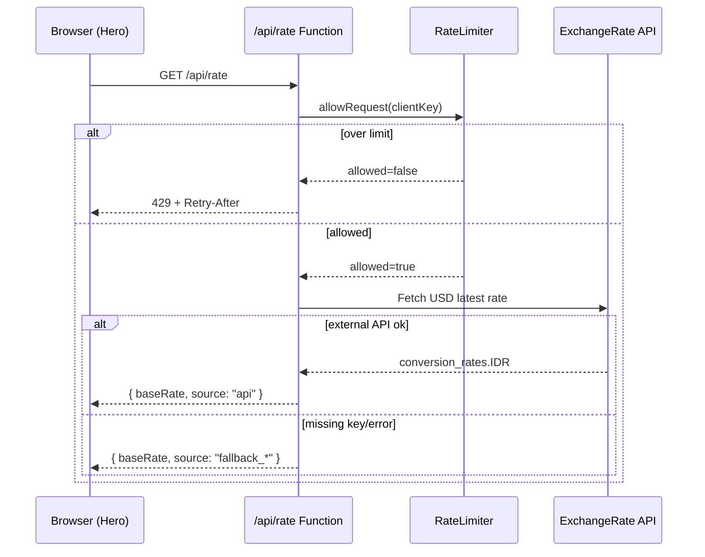
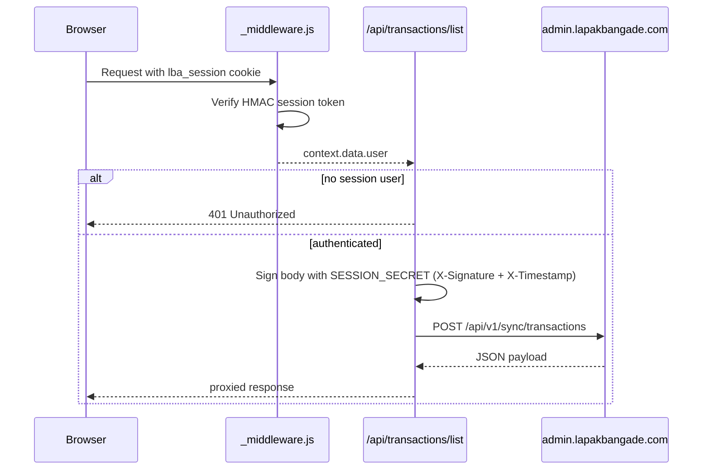

# Architecture Overview

Lapak Bang Ade is a React + TypeScript landing page deployed on Cloudflare Pages. It combines static marketing content, client-side routing, and Cloudflare Pages Functions for authentication/session bridging and rate/transaction API proxying.

## System Architecture

```mermaid
graph TB
    U[User Browser] --> SPA[React SPA (build/dist)]
    SPA --> RT[/api/rate<br/>Cloudflare Function/]
    SPA --> AUTH[/api/auth/*<br/>Cloudflare Function/]
    SPA --> TX[/api/* sync endpoints<br/>Cloudflare Function/]

    RT --> EXR[ExchangeRate API]
    AUTH --> GG[Google OAuth]
    TX --> BOT[Admin Backend API<br/>admin.lapakbangade.com]

    subgraph Cloudflare Pages Project
      SPA
      RT
      AUTH
      TX
    end

    subgraph Optional Local Runtime
      EX[Express server.js]
      P[Passport OAuth]
    end

    U -. local dev/legacy .-> EX
    EX --> P
    EX --> BOT
```

## Main Components

| Layer | Current implementation | Key files |
|---|---|---|
| Frontend app | React 19 SPA with client routing and lazy-loaded pages | `build/App.tsx`, `build/components/*` |
| Auth state | Frontend context pulls `/api/auth/me` and drives guarded dashboard access | `build/hooks/useAuth.tsx` |
| Landing business logic | Live rate fetch, fee/top-up calculations, analytics tracking | `build/components/Hero.tsx`, `build/services/rates.ts`, `build/services/analytics.ts` |
| Edge API layer | Cloudflare Pages Functions for auth, rate, and backend sync calls | `build/functions/**` |
| Security helpers | Sliding-window limiter and validation/sanitization utilities | `build/utils/rateLimiter.ts`, `build/utils/validation.ts` |
| Deployment | Cloudflare Pages build/deploy (manual + GitHub Actions) | `build/wrangler.toml`, `.github/workflows/ci-cd.yml` |
| Optional Node runtime | Express + Passport fallback/legacy API proxy | `server.js`, `auth.js` |

## Frontend Route Map

Current routes are served via React Router:

- `/` -> landing page
- `/privacy` -> privacy policy
- `/terms` -> terms
- `/dashboard` -> authenticated dashboard UI
- `/convert-paypal-ke-:bankId` -> programmatic bank SEO page
- `/convert-paypal-ke-:ewalletId` -> programmatic e-wallet SEO page
- `/untuk-:useCaseSlug` -> programmatic use-case SEO page

Reference: `build/App.tsx`.

## Core Data Flows

### 1. Public Exchange Rate Flow



### 2. Authenticated Dashboard Sync Flow



## Current State vs Planned Work

### Current (implemented in repo)

- Cloudflare Functions routing for auth/session and backend sync calls.
- `/api/rate` with fallback behavior and in-memory sliding-window limiting.
- Input validation/sanitization utility module (`validation.ts`) ready for broader API integration.
- Vitest-based test suite for rate service, analytics service, and Hero component.
- CI/CD pipeline for test/build/audit and Cloudflare preview/production deployments.
- Husky pre-commit hook running frontend checks before commit.

### In Progress / Planned (Queues 1-3)

| Queue | Area | Planned direction |
|---|---|---|
| Queue 1 | Security | Expand validation to all transaction/auth inputs and complete server-side validator integration for all edge endpoints |
| Queue 1 | Rate limiting | Apply limiter patterns beyond `/api/rate` to additional sensitive endpoints |
| Queue 2 | Quality | Broaden tests from unit scope to API integration and Playwright E2E coverage |
| Queue 3 | Feature enhancement | Real-time transaction updates, stronger anti-fraud indicators, and richer dashboard analytics |

This document reflects what exists now and intentionally marks these as queued follow-up work.

## Operational Notes

- Cloudflare Pages is the primary deployment target.
- `server.js` remains useful for local/legacy workflows but is not the preferred production path.
- Sessions are stateless and cookie-based at the edge layer.
- External dependencies with highest runtime impact:
  - Google OAuth endpoints
  - `admin.lapakbangade.com` sync APIs
  - Exchange rate provider API

_Last updated: March 2026_
